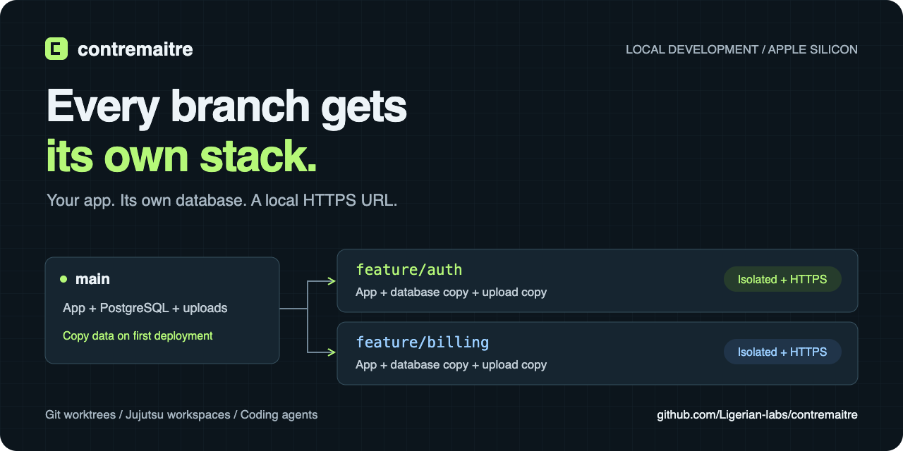

<p align="center">
  
</p>

# Contremaitre

[](LICENSE)

**Every branch gets its own stack.**

Run your app, PostgreSQL, Redis, and uploaded files in isolated local environments for Git branches and Jujutsu workspaces. New environments copy data from your designated main environment and get their own HTTPS `.localhost` URLs. Built on [Apple container](https://github.com/apple/container) for Apple silicon Macs.

[Get started](#get-started) · [Try a data fork](#try-a-data-fork) · [Coding agents](#use-with-coding-agents) · [Documentation](#documentation) · [Contribute](CONTRIBUTING.md)

## Why Contremaitre?

A worktree separates your code. Your app still needs a database, uploaded files, and somewhere to listen. Run several branches or coding agents at once, and those shared resources become a problem.

Contremaitre gives each workspace and branch its own environment:

| What you need | What Contremaitre does |
| --- | --- |
| Test a migration without changing main's database | Copies managed PostgreSQL data when an environment is first deployed |
| Keep uploaded files with their branch | Copies declared file volumes from main, then keeps each copy independent |
| Run several stacks using the same internal ports | Gives each environment a private container network and local HTTPS routes |
| Return to a branch later | Retains its data across redeploys and `down` |
| Edit code inside a development container | Syncs source changes to Linux so the app's file watcher can reload |
| Check an agent's changes in a browser | Runs configured verification commands and returns a local review page with logs and artifacts |

Git worktrees and Jujutsu workspaces on the same branch remain separate. A plain branch switch selects a different environment when you next deploy.

## Get started

You need an **Apple silicon Mac running macOS 26**, [Homebrew](https://brew.sh), and [Bun 1.4.2](https://github.com/oven-sh/bun/releases/tag/bun-v1.4.2) to build from source. Application images must support ARM64. The compiled CLI includes Bun.

```sh
brew install container traefik mkcert
mkcert -install

git clone https://github.com/Ligerian-labs/contremaitre.git
cd contremaitre
bun install --frozen-lockfile
make install
export PATH="$HOME/.local/bin:$PATH"

contremaitre https-service install
contremaitre start
```

`mkcert -install` trusts a local development certificate authority. The HTTPS service requests administrator approval to forward port 443 in the background. Run the hub and applications as your normal user. See [HTTPS setup and troubleshooting](docs/local-https.md) if a port is occupied or certificates are not trusted.

After pulling updates, run `bun install --frozen-lockfile` and `make install` again. Installation replaces the CLI and automatically restarts a running hub with the new binary, preserving its HTTP or HTTPS ports and running environments. Active operations and tunnel sessions end, and local routing pauses during the restart. A stopped hub stays stopped. Set `CONTREMAITRE_HOME` when upgrading a hub that uses a custom data directory.

Deploy the included example:

```sh
cd examples/stack
contremaitre deploy --branch main --main
contremaitre show --branch main
```

Open the web URL printed by `show`. You now have a static web page, PostgreSQL, and Redis on a private network. The page does not query the databases; the next example demonstrates data isolation directly. The router dashboard is at [https://contremaitre.localhost](https://contremaitre.localhost).

For your own app, run `contremaitre init` from its repository, review the generated `.contremaitre.yaml`, then run `contremaitre deploy --main`. Init can use an installed coding agent to inspect your stack. Use `contremaitre init --no-ai` for conventional Dockerfile detection. [Read the setup options](docs/assisted-init.md).

## Try a data fork

Continue in `examples/stack` after deploying main. Add one row to its database:

```sh
contremaitre exec --branch main postgres -- psql -U app -d app -c \
  "CREATE TABLE IF NOT EXISTS demo (message text); INSERT INTO demo VALUES ('hello from main');"
```

Deploy a second environment and read its copy:

```sh
contremaitre deploy --branch feature-demo
contremaitre exec --branch feature-demo postgres -- psql -U app -d app -c \
  "SELECT * FROM demo;"
contremaitre show --branch feature-demo
```

The query returns `hello from main`. Both environments have their own web URL and database. Change the copy and check main:

```sh
contremaitre exec --branch feature-demo postgres -- psql -U app -d app -c \
  "UPDATE demo SET message = 'changed in feature';"
contremaitre exec --branch main postgres -- psql -U app -d app -c \
  "SELECT * FROM demo;"
```

Main still returns `hello from main`. Redeploying `feature-demo` preserves its changed row. The explicit `--branch` names let you try this without changing Git branches; normal deployments detect the current branch or bookmark.

Cloning pauses main's application services while copying PostgreSQL data and declared file volumes, then restarts them. Redis starts empty in the new environment. Copies use disk space and do not merge back into main.

Stop the example environments when finished. Their data stays available for a later deploy:

```sh
contremaitre down --branch feature-demo
contremaitre down --branch main
```

## Use with coding agents

Give Claude Code, Codex, OpenCode, or Pi an environment for each workspace and a way to report what it actually checked.

From your application repository, install the integration and ensure the environment is running:

```sh
contremaitre agents install --agent all
contremaitre ensure --json
```

The bundle includes `contremaitre-setup` for manifests and development stacks, `contremaitre` for testing and local previews, and `contremaitre-share` for requested public previews. Choose one agent with `--agent codex`, `claude`, `opencode` or `pi`; add `--global` for a user-wide installation. Restart your agent or reload its skills, then ask it to set up, test or share your application.

To distribute the native plugin bundle from the installed CLI, run `contremaitre agents export DIRECTORY` with an existing parent directory. It writes a `contremaitre` folder containing Codex and Claude plugin manifests, a Pi package, skills and adapters. See [plugin loading and updates](docs/agent-workflow.md#export-a-native-plugin).

Define a `smoke` verification profile using your application's existing test commands, following the [verification configuration guide](docs/agent-workflow.md#check-configuration). Then run:

```sh
contremaitre verify --profile smoke --json
contremaitre report --json
```

The report includes preview links, verification results, source freshness, and a local review page. Missing checks are reported as unconfigured; source changes mark earlier results stale. Verification runs your commands and does not invoke a model. [Agent setup and evidence limits](docs/agent-workflow.md).

## Daily commands

Run these from an application repository with a Contremaitre manifest:

```sh
contremaitre deploy                    # Build and wait for readiness
contremaitre show                      # Print this environment's web URLs
contremaitre list                      # List all environments
contremaitre logs web                  # Read a service's application logs
contremaitre deploy logs --failure     # Inspect the latest failed deployment
contremaitre down                      # Stop this environment, retain its data
```

Use your manifest's service name in place of `web`. Run `contremaitre --help` for the full command list.

## What to expect

Contremaitre is in early development. The local runtime supports managed PostgreSQL 17, Redis, application containers, data forks, local HTTPS, and source sync. See the [recorded runtime verification](docs/structure-verification.md) for the tested setup and its limits.

- macOS and Apple silicon only. No Linux, Windows, or Intel Mac runtime support.
- Build-based services need redeployment after edits. Source sync and hot reload require a [development-service configuration](docs/assisted-init.md#development-services).
- Compose import accepts a limited subset. Contremaitre does not execute arbitrary Compose files.
- Public sharing is optional and requires a compatible tunnel provider. See [tunnel setup and provider requirements](docs/reference.md#tunnel-providers) before relying on it.
- Data forks copy the managed `app` database and matching declared file volumes. They are not instantaneous snapshots, and migrations do not roll back automatically.

## Documentation

| Guide | Read it for |
| --- | --- |
| [Full reference](docs/reference.md) | Manifest fields, environment identity, data lifecycle, commands, and tunnels |
| [Local HTTPS](docs/local-https.md) | Certificates, port forwarding, and the Traefik dashboard |
| [Initialization and hot reload](docs/assisted-init.md) | Agent-assisted setup, Dockerfiles, and development containers |
| [Agent verification](docs/agent-workflow.md) | Test profiles, artifacts, review pages, and source freshness |
| [Project drivers](docs/project-drivers.md) | Integrating an existing deployment system |
| [Workspace architecture](docs/workspace-layout.md) | Package ownership and dependency rules |

## License

[Apache License 2.0](LICENSE).

## Help shape Contremaitre

Try the example, then bring your own stack. [Report a bug](https://github.com/Ligerian-labs/contremaitre/issues/new?template=bug_report.yml) with the command that failed and a minimal manifest, or [describe a workflow you need](https://github.com/Ligerian-labs/contremaitre/issues/new?template=feature_request.yml).

See [CONTRIBUTING.md](CONTRIBUTING.md) for development setup and checks. If you want to come back to Contremaitre, **star the repository**. Sharing a concrete example of how you use it helps other developers decide whether to try it.
